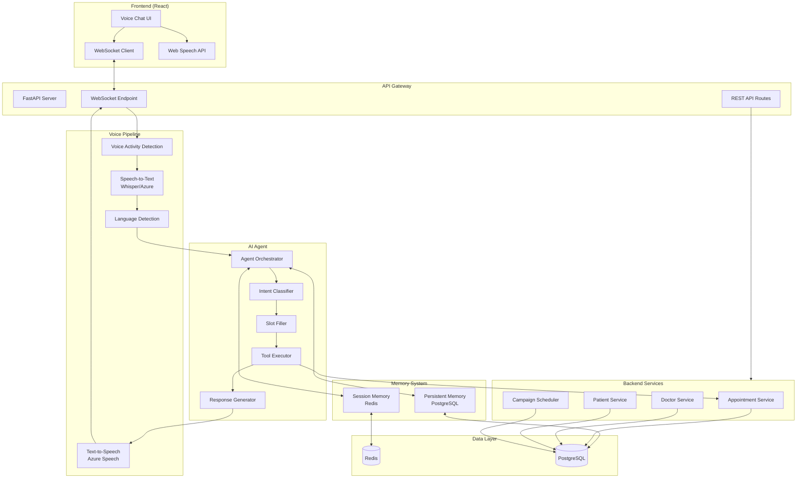
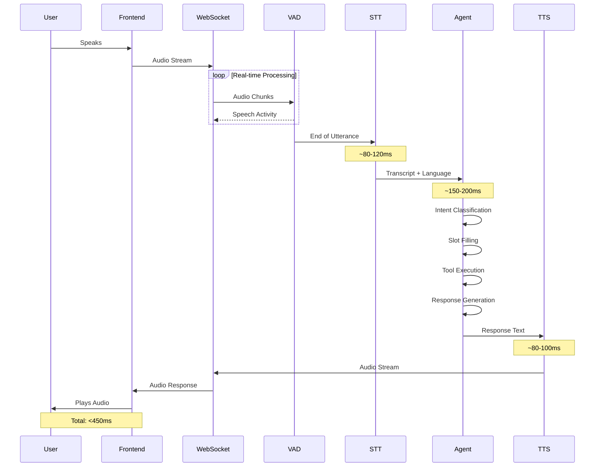
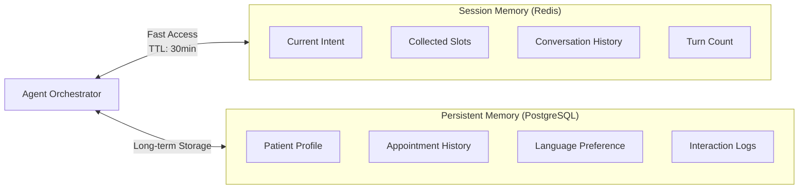
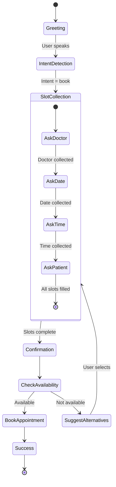
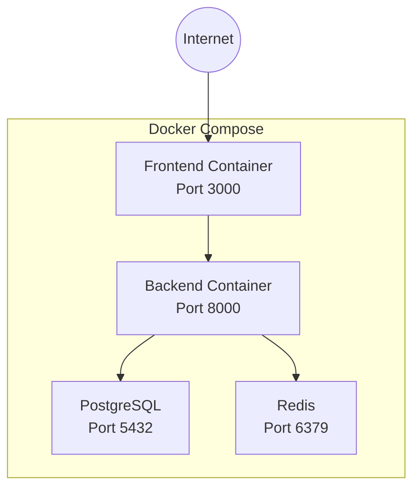

# System Architecture

## High-Level Architecture Diagram

## Real-Time Voice Pipeline

## Memory Architecture

## Component Responsibilities

### Voice Pipeline
| Component | Function | Latency Target |
|-----------|----------|----------------|
| VAD | Detect speech boundaries | Real-time |
| STT | Convert speech to text | 80-120ms |
| Language Detection | Identify en/hi/ta | 10ms |
| TTS | Convert text to speech | 80-100ms |

### AI Agent
| Component | Function |
|-----------|----------|
| Orchestrator | Coordinates all reasoning |
| Intent Classifier | Identifies user intent |
| Slot Filler | Extracts entities |
| Tool Executor | Calls appointment APIs |
| Response Generator | Creates multilingual responses |

### Memory
| Type | Storage | Purpose | TTL |
|------|---------|---------|-----|
| Session | Redis | Current conversation | 30 min |
| Persistent | PostgreSQL | User history | Permanent |

## Data Flow for Appointment Booking

## Deployment Architecture

